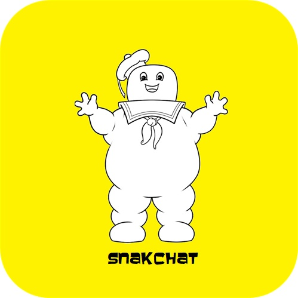

<!--
*** Thanks for checking out the Best-README-Template. If you have a suggestion
*** that would make this better, please fork the repo and create a pull request
*** or simply open an issue with the tag "enhancement".
*** Thanks again! Now go create something AMAZING! :D
***
***
***
*** To avoid retyping too much info. Do a search and replace for the following:
*** github_username, repo_name, twitter_handle, email, project_title, project_description
-->

<!-- PROJECT SHIELDS -->
<!--
*** I'm using markdown "reference style" links for readability.
*** Reference links are enclosed in brackets [ ] instead of parentheses ( ).
*** See the bottom of this document for the declaration of the reference variables
*** for contributors-url, forks-url, etc. This is an optional, concise syntax you may use.
*** https://www.markdownguide.org/basic-syntax/#reference-style-links
-->
[![Contributors][contributors-shield]][contributors-url]
[![Forks][forks-shield]][forks-url]
[![Stargazers][stars-shield]][stars-url]
[![Issues][issues-shield]][issues-url]

<!-- PROJECT LOGO -->
 

  

  <h3 align="center">SnakChat - Post, Explore, Indulge - Unique Snacks Blog</h3>

  

    UA Bootcamp - Project #2
         
        <a href="https://github.com/rookoyole/snakchat"><strong>Explore the docs »</strong></a>
         
         
        <a href="https://github.com/rookoyole/snakchat">View Demo</a>
        ·
        <a href="https://github.com/rookoyole/snakchat/issues">Report Bug</a>
        ·
        <a href="https://github.com/rookoyole/snakchat/issues">Request Feature</a>
  

<!-- TABLE OF CONTENTS -->

  
<h2 style="display: inline-block">Table of Contents</h2>

  <ol>
    <li><a href="#about-the-project">About The Project</a></li>
    <li><a href="#project-links">Project Links</a></li>
    <li><a href="#contact">Contact</a></li>
  </ol>

<!-- ABOUT THE PROJECT -->
## About The Project

[![Product Name Screen Shot][product-screenshot]](public/images/screenshot.png)
 
The purpose of this project was to create a full-stack site for a snack blog, including a SQL database, secure login, interactive UI and launched on Heroku.

Features:
* XXX

<!-- PROJECT LINKS -->
## Project Links

Repository Link: [https://github.com/rookoyole/snakchat](https://github.com/rookoyole/snakchat)

Deployed Application: [https://lit-anchorage-48237.herokuapp.com/](https://lit-anchorage-48237.herokuapp.com/)

<!-- CONTACT -->
## Contact

Kyle Ryan - rookoyole@gmail.com

Maribel Ellison - maribel.duron86@gmail.com

Hunter Montano - montano.hu.s@gmail.com

Thomas Kubant - thomaskubant@gmail.com

Template from: https://github.com/othneildrew/Best-README-Template/blob/master/README.md

<!-- MARKDOWN LINKS & IMAGES -->
<!-- https://www.markdownguide.org/basic-syntax/#reference-style-links -->
[contributors-shield]: https://img.shields.io/github/contributors/rookoyole/snakchat.svg?style=for-the-badge
[contributors-url]: https://github.com/rookoyole/snakchat/graphs/contributors
[forks-shield]: https://img.shields.io/github/forks/rookoyole/snakchat.svg?style=for-the-badge
[forks-url]: https://github.com/rookoyole/snakchat/network/members
[stars-shield]: https://img.shields.io/github/stars/rookoyole/snakchat.svg?style=for-the-badge
[stars-url]: https://github.com/rookoyole/snakchat/stargazers
[issues-shield]: https://img.shields.io/github/issues/rookoyole/snakchat.svg?style=for-the-badge
[issues-url]: https://github.com/rookoyole/snakchat/issues
[product-screenshot]: public/images/screenshot.png